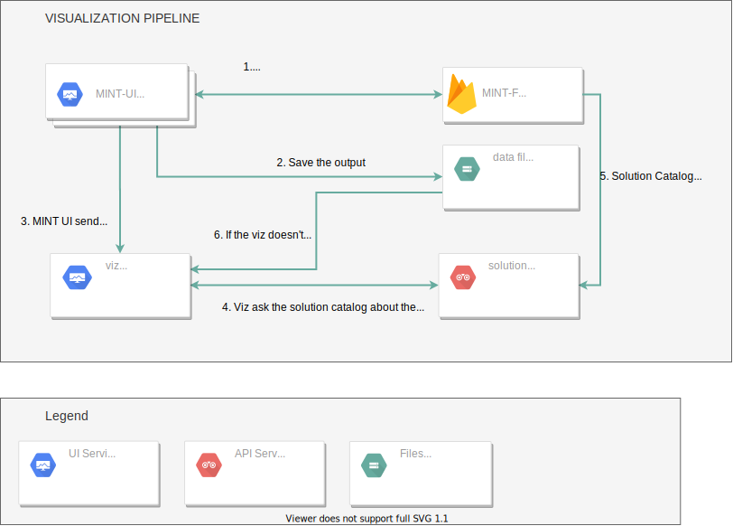

## Visualization


In this example, we are going to download the files of a thread.

### Parameters

Define the parameters from MINT.

```python
scenario_id = 'R3H4Q3ab61aTaSS4bTCj' # str | The ID of the scenario
subgoal_id = 'fvZDFeMtprjRedV4msVY' # str | The ID of the subgoal
thread_id = '0N2PN1GafgVVFtAHM3z4' # str | The ID of the thread
```

### Send the request and download


```python
# Define the destination path (optional)
destination_path = Path("/tmp")
try:
    # Get the results of a thread
    api_response = api_instance.results_scenario_id_subgoal_id_thread_id_get(scenario_id, subgoal_id, thread_id)
    # Download the files
    for result_model in api_response['thread']['results']:
        for result in api_response['thread']['results'][result_model]:
            #Optionally, you can filter the files using the model catalog uris
            files = download_files(result['has_output'], dir_path=destination_path, target_data_urls=["https://w3id.org/okn/i/mint/modflow_2005_BartonSprings_avg_cbb"])
except ApiException as e:
    print("Exception when calling ResultsApi->results_scenario_id_subgoal_id_thread_id_get: %s\n" % e)
```


## Full example

```python
from __future__ import print_function
import time
import solutioncatalog
from solutioncatalog.rest import ApiException
from pprint import pprint
from solutioncatalog.download import  download_files
from pathlib import Path

api_instance = solutioncatalog.ResultsApi(solutioncatalog.ApiClient())
scenario_id = 'R3H4Q3ab61aTaSS4bTCj' # str | The ID of the scenario
subgoal_id = 'fvZDFeMtprjRedV4msVY' # str | The ID of the subgoal
thread_id = '0N2PN1GafgVVFtAHM3z4' # str | The ID of the thread


destination_path = Path("/tmp")
try:
    # Get the results of a thread
    api_response = api_instance.results_scenario_id_subgoal_id_thread_id_get(scenario_id, subgoal_id, thread_id)
    for result_model in api_response['thread']['results']:
        for result in api_response['thread']['results'][result_model]:
            files = download_files(result['has_output'], dir_path=destination_path, target_data_urls=["https://w3id.org/okn/i/mint/modflow_2005_BartonSprings_avg_cbb"])
except ApiException as e:
    print("Exception when calling ResultsApi->results_scenario_id_subgoal_id_thread_id_get: %s\n" % e)
pprint(files)
```

## Visualization pipeline


